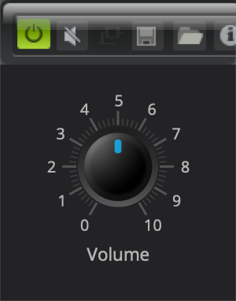
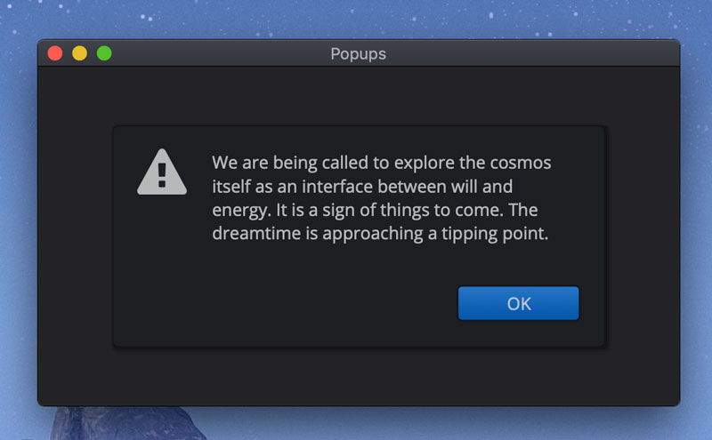

---
---
# About

## History

<div class = "img-align-right" style="width:35%">
  
  <p>HDPI Matters. Zoom in and notice the standard DPI icons at the top
   (e.g. the Power Button from the VST3 Plug-in Test Host), vs. Elements’
   vector dials.</p>
</div>

Sometime in 2014, I started searching for a GUI library I can use for some of
the projects I am developing. The most important requirements to me were:

1. It should be open source with a liberal, non-viral license.
2. It should be usable in any application and should play well with other GUI
   libraries and frameworks.
3. Corollary to the second requirement is that it can also be used
   to develop plugins (e.g. it should not own the event loop and can co-exist
   with elements within a plugin host such as VST and AU.
4. It should be resolution independent and allows for HDPI displays.

I tried hard to find something that satisfies these requirements. I failed.
I did not find any. JUCE comes close, but it did not satisfy the first requirement.
iPlug is usable. I actually prototyped some plugins using it,
but it did not satisfy the 4th requirement.
I’m also unsure if it satisfies the 2nd requirement.

There are other requirements, such as not relying on a “visual” GUI editor or
code generator. IMO, the GUI should be declared in the code. Obviously,
good design and architecture is also another requirement. Most GUI C++ libraries
are just too 90s for me to consider. None of that crappy OOP bleh! But, hey,
I am digressing! The truth is, I am even willing to use a library with
a pure C interface, such as GLFW, as long as it is well designed
(GLFW is simple and clean) and can be wrapped in C++ anyway. I also tried to use
NanoVG — not really a GUI library, but it makes it easier to write one (NanoVG
inspired Elements’ Cairo based vector graphics canvas).

I know that perfect is the enemy of the good, but I just can’t resist it.
I couldn’t stand it anymore. So at around 2016, I decided to write my own.
Actually, I did not start from scratch. I had a head start:
I’ve been writing GUI libraries since the 90s. One of the main projects I got
involved with when I was working in Japan in the 90s was a lightweight
GUI library named Pica. So I went ahead, dusted off the old code and rewrote it
from the ground up using modern C++.

## Flyweight

Elements, is very lightweight… and extremely modular. You compose very fine-grained,
flyweight “elements” to form deep element hierarchies using a declarative
interface with heavy emphasis on reuse. A specific example should make it clear.
Here’s the standard message box (included in elements’ gallery a collection of
reusable element compositions):

```cpp
inline auto message_box1(
   char const* message
, std::uint32_t icon_id
, char const* ok_text = "OK"
, size size_ = get_theme().message_box_size
, color ok_color = get_theme().indicator_color
)
{
   auto textbox = static_text_box{ message };
   auto ok_button = share(button(ok_text, 1.0, ok_color));
   auto popup = share(
      key_intercept(align_center_middle(
         fixed_size(size_,
         layer(
            margin({ 20, 20, 20, 20 },
               vtile(
                  htile(
                     align_top(icon{ icon_id, 2.5 }),
                     left_margin(20, std::move(textbox))
                  ),
                  align_right(hsize(100, hold(ok_button)))
               )
            ),
            panel{}
      )))));
   popup->on_key =
      [ok_ = get(ok_button)](auto k)
      {
         if (k.key == key_code::enter)
         {
            if (auto ok = ok_.lock())
               ok->value(true);
            return true;
         }
         return false;
      };
   return std::pair{ ok_button, popup };
}
```

The client uses the gallery code above like this:

```cpp
void quantum_bs(view& view_)
{
   char const* alert_text =
      "We are being called to explore the cosmos itself as an "
      "interface between will and energy. It is a sign of things "
      "to come. The dreamtime is approaching a tipping point."
      ;
   auto [ok_button, popup] = message_box1(alert_text, icons::attention);
   view_.add(popup);
   ok_button->on_click =
      [](bool state)
      {
         // Do something here when the button is clicked
      };
}
```



Some quick highlights, beyond the obvious:

- `share`: This element is supposed to be shared (using std::shared_ptr).
   E.g. when returned from functions like this one. Typically you’d want to share
   elements that you need to have access to elsewhere in your code.
- `hold`: Hold a shared element somewhere in a view hierarchy.
- `key_intercept`: A delegate element that intercepts key-presses.
- `fixed_size`: An element that fixes the size of its contained element
   (Elements are extremely lightweight, and typically, do not even have sizes
   nor know their positions in the view hierarchy).
- `margin`, `left_margin`: Two of the many margins, including `right_margin`,
   `top_margin`, etc., adds some padding, `margin` in this case 20 pixels all
   around the contained element, while `left_margin` adds a padding of 20 to
   separate the icon and the text box.
- `layer`: Element composites that place elements in multiple layers.
- `panel`: A simple window-like panel box.
- `vtile`, `htile`: Fluid vertical and horizontal layout elements that allocate
   enough space for their contained elements allowing for ‘stretchiness’
   (the ability of elements to stretch within a defined minimum and maximum size
   limits; elements can have infinite sizes) as well as fixed sizing and vertical
   and horizontal alignment (0% to 100%). Vertical and horizontal tiles are used
   all over the place to place elements in a grid.
- `align_top`, `align_right`, `align_center_middle`: Aligns its element to the
   top, right, and center (horizontally) middle (vertically), respectively.
   Like the margins, we have a lot of these align elements.
- `on_key`: Attaches a call-back (lambda) function to the key_intercept element
   (strategically placed in the outermost level), to send a value of true to the
   ok_button, essentially programmatically clicking it when the user presses
   the enter key.
- `get`: To avoid `shared_ptr` cycles, we use a `weak_pointer`, via the get
   function. We’ll need to “lock” this to get the actual shared pointer later
   in the callback.

Modularity and reuse are two of the most important design aspects. For example,
the button element is actually composed of even smaller elements. Here’s part of
the code responsible for making the buttons above (also in the gallery):

```cpp
auto constexpr button_margin = rect{ 10, 5, 10, 5 };
template <typename Button>
inline Button make_button(
   std::string const& text
, float size = 1.0
, color body_color = get_theme().default_button_color
)
{
   return make_button<Button>(
      margin(
         button_margin,
         align_center(label(text, size))
      ),
      body_color
   );
}
```

After a while, code reuse, using a palette of fine-grained elements, becomes
very familiar and intuitive, much like using HTML. The declarative C++ code
tells you what rather than how (imperative).

And, as promised, the elements are very fine grained. Here’s the actual button
class we are using here:

```cpp
class layered_button : public array_composite<2, deck_element>
{
public:
   using base_type = array_composite<2, deck_element>;
   using button_function = std::function<void(bool)>;
   using base_type::value;
                     template <typename W1, typename W2>
                     layered_button(W1&& off, W2&& on);
   virtual element*  hit_test(context const& ctx, point p) override;
   virtual element*  click(context const& ctx, mouse_button btn) override;
   virtual void      drag(context const& ctx, mouse_button btn) override;
   virtual bool      is_control() const override;
   virtual void      value(int new_state) override;
   virtual void      value(bool new_state) override;
   bool              value() const;
   button_function   on_click;
protected:
   bool              state(bool new_state);
private:
   bool              _state;
};
```

The layered button is a type of button that basically has two states:
pushed and un-pushed. It does not know how to draw the two states. Rather,
it delegates the states to two elements, composed as a 2-layer composite element,
using the deck element. The class itself has nothing more than a single(!)
member variable _state. That’s it! And talking about flexibility,
the deck is generic and may contain any kind of element, or even your own custom
drawable element. Here’s an example of a custom element that draws an infinitely
resizable filled round-rectangle:

```cpp
auto box = min_size({ 5, 5 },
   basic(
      [](context const& ctx)
      {
         auto& c = ctx.canvas;
         c.begin_path();
         c.round_rect(ctx.bounds, 4);
         c.fill_style(colors::gold.opacity(0.8));
         c.fill();
      }
   )
);
```

Elements has its own HTML5 inspired canvas drawing engine using Cairo underneath.

## For now...

There’s obviously still a lot to cover, but for now, this quick tour of Elements
should suffice. Is it ready yet? Is it usable? Well, I am already using it,
at least for the MacOS, which is my preferred development system. I am using it
in the Ascend project. But, I have to be honest. While it is usable, and based
on very solid architecture and design, there is still a lot of work to do.

And so that being said, if anyone out there, familiar with modern C++
(esp. C++14 and C++17), finds this brief introduction compelling enough,
I would very much welcome some help. Hey, this is Open Source. The license will
remain permissive and liberal (currently MIT).
Send me an email! joel-at-cycfi-dot-com.
