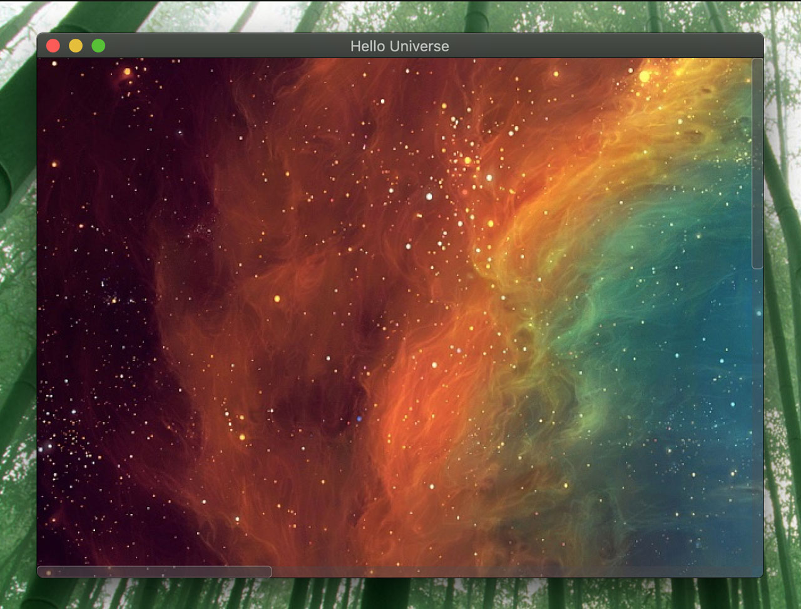
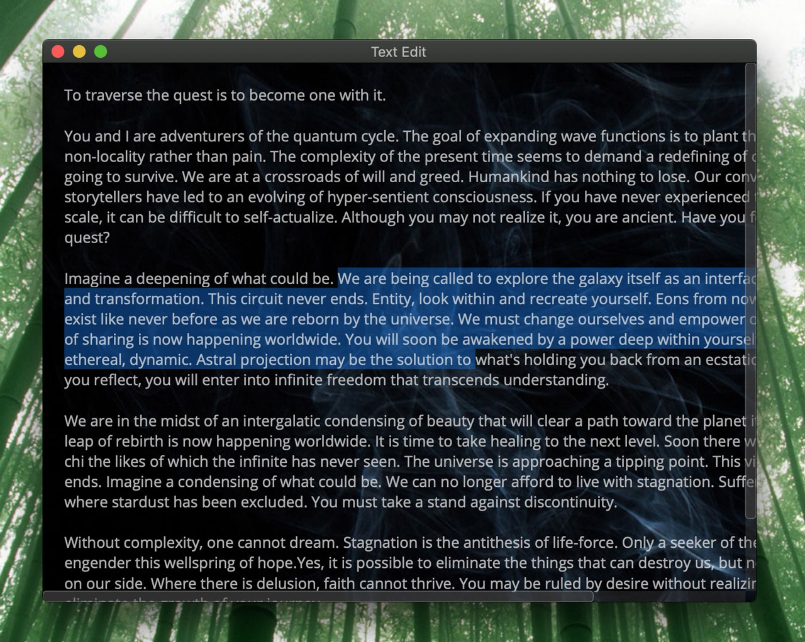
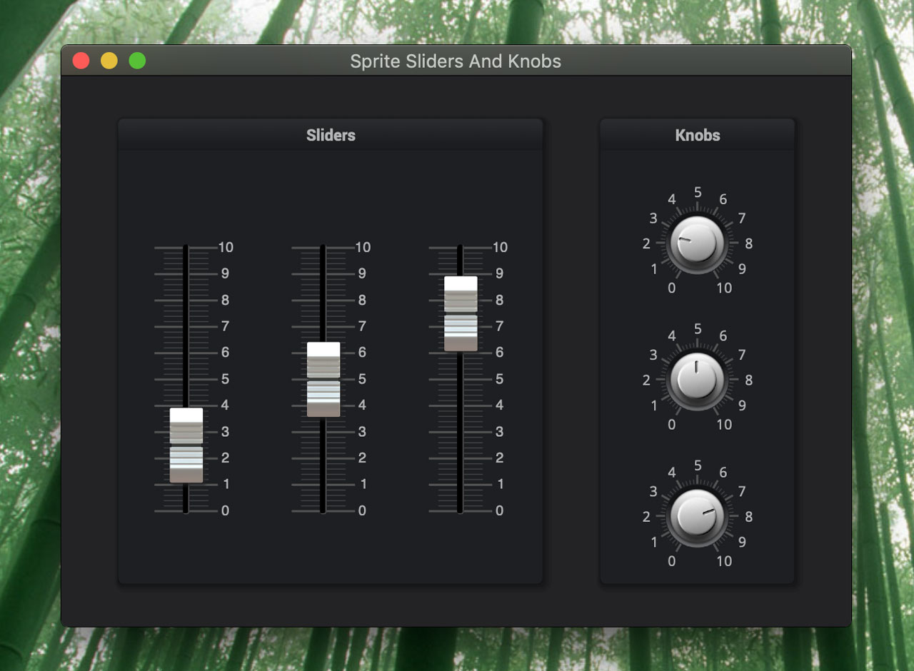
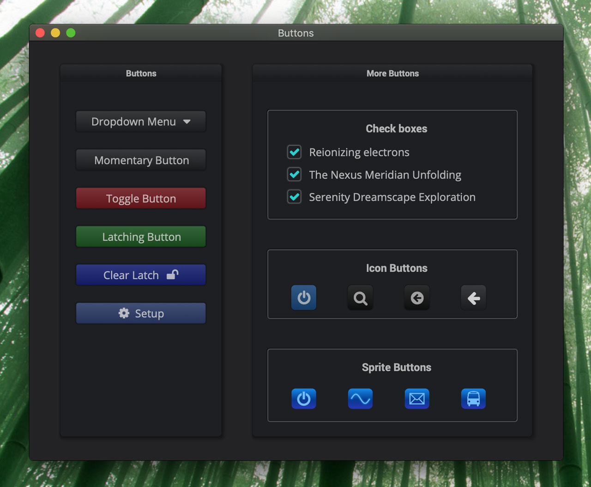
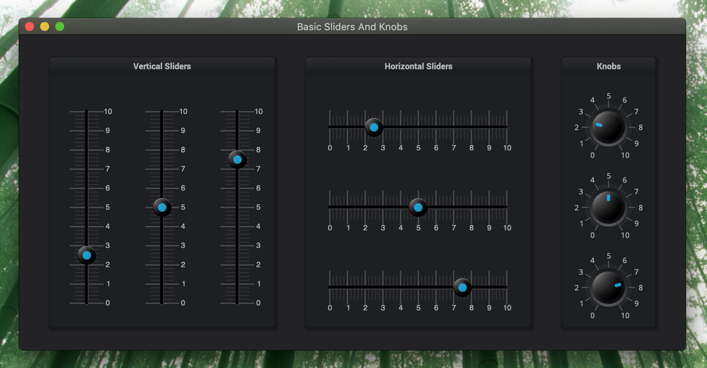
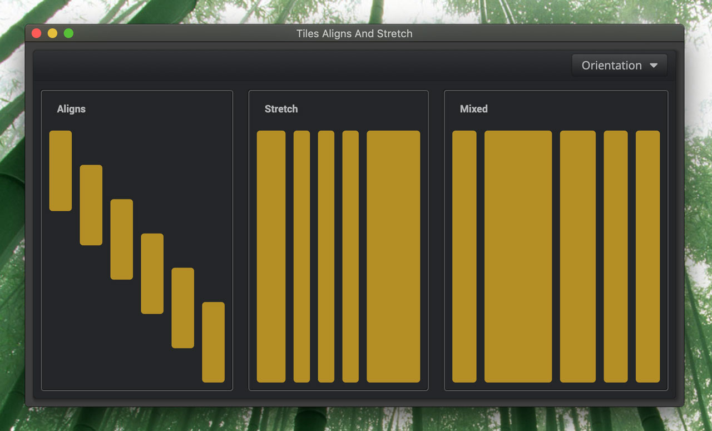
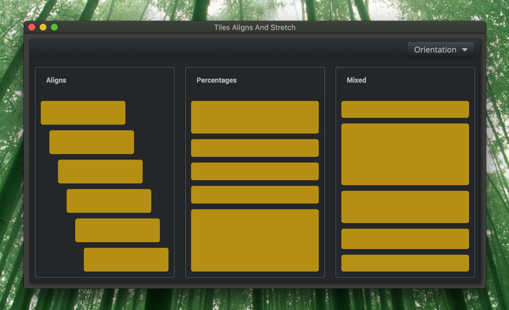
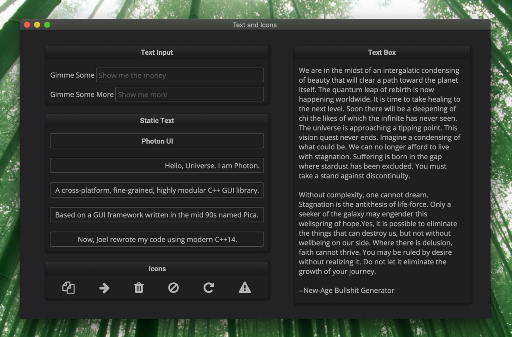
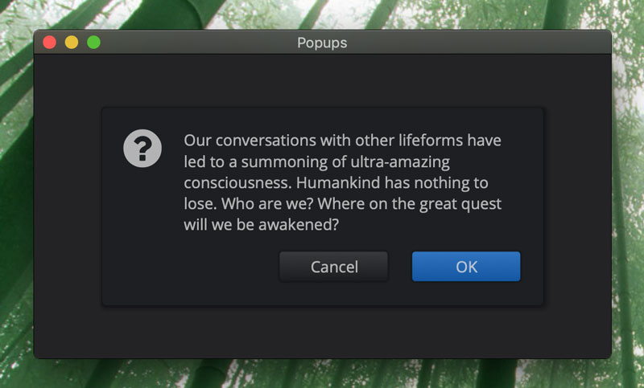
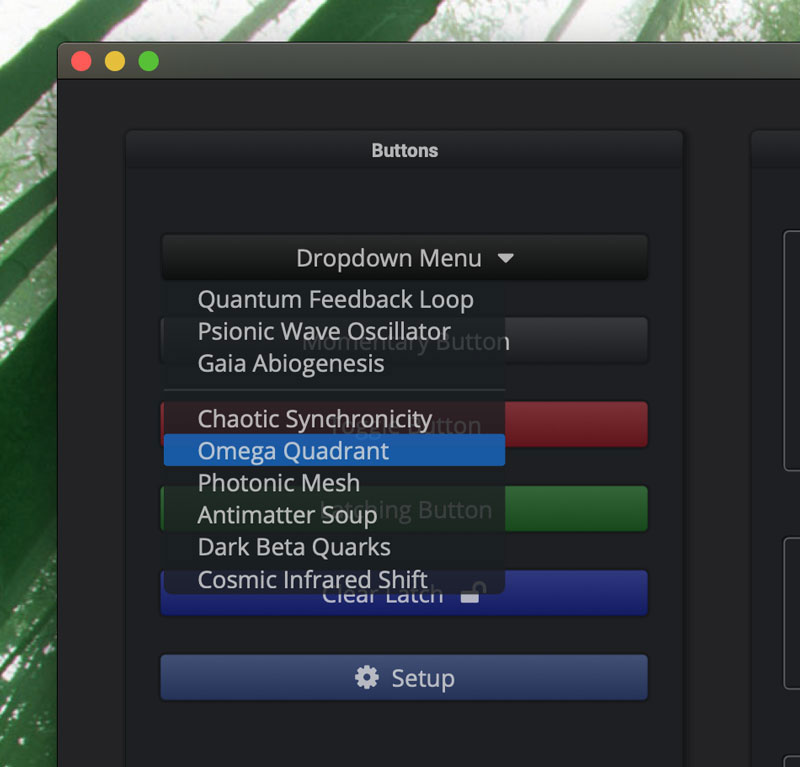

---
---
# Gallery

It’s always a nice to have some pretty pictures:

  

    

      
    

    

      
    

    

      
    

    

      
    

    

      
    

  

  

    

      
    

    

      
    

    

      
    

    

      
    

    

      
    

  

-------------------------------------------------------------------------------

*Copyright (c) 2014-2020 Joel de Guzman. All rights reserved.*
*Distributed under the [MIT License](https://opensource.org/licenses/MIT)*
