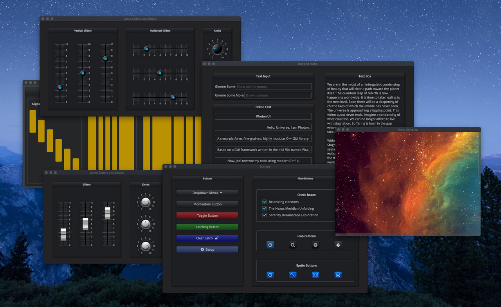

# Elements C++ GUI library

## Introduction

Elements is a lightweight, fine-grained, HDPI capable, resolution independent, modular GUI library, designed with these requirements in mind:

1. It should be open source with a liberal, non-viral license.
2. It should be usable in any application and should play well
   with other GUI libraries and frameworks.
3. Corollary to the second requirement is that it can also be used
   to develop plugins (e.g. it should not own the event loop and can
   co-exist with elements within a plugin host such as VST and AU.
4. It should be resolution independent and allows for HDPI displays.
5. Should not rely on a “visual” GUI editor or code generator.
   The GUI should be declared in the code.
6. Declarative API using modern C++. Declarative C++ code
   tells you what rather than how (imperative).

Elements, is extremely lightweight… and modular. You compose very
fine-grained, flyweight “elements” to form deep element hierarchies using a
declarative interface with heavy emphasis on reuse.

## Setup and Installation

The Elements C++ GUI library is cross-platform. Follow the [Setup and
Installation guide](setup) to get started using the library.

## About the Author

Joel got into electronics and programming in the 80s because almost
everything in music, his first love, is becoming electronic and digital.
Since then, he builds his own guitars, effect boxes and synths. He enjoys
playing distortion-laden rock guitar, composes and produces his own music in
his home studio.

Joel de Guzman is the principal architect and engineer at [Cycfi
Research](https://www.cycfi.com/) and a consultant at [Ciere
Consulting](https://ciere.com/). He is a software engineer specializing in
advanced C++ and an advocate of Open Source. He has authored a number of
highly successful Open Source projects such as
[Boost.Spirit](http://tinyurl.com/ydhotlaf),
[Boost.Phoenix](http://tinyurl.com/y6vkeo5t) and
[Boost.Fusion](http://tinyurl.com/ybn5oq9v). These libraries are all part of
the [Boost Libraries](http://tinyurl.com/jubgged), a well respected,
peer-reviewed, Open Source, collaborative development effort.

-------------------------------------------------------------------------------

*Copyright (c) 2014-2020 Joel de Guzman. All rights reserved.*
*Distributed under the [MIT License](https://opensource.org/licenses/MIT)*
