---
---
# Layout

## Table of Contents
* [Limits](#limits)
* [Size Elements](#size-elements)
* [Stretch Elements](#stretch-elements)
* [Scale Element](#scale-element)
* [Align Elements](#align-elements)
* [Margin Elements](#margin-elements)
* [Floating](#floating-element)
* [Tiles and Grids](#tiles-and-grids)
* [Horizontal Grids](#horizontal-grids)
* [Horizontal Tiles](#horizontal-tiles)
* [Vertical Grids](#vertical-grids)
* [Vertical Tiles](#vertical-tiles)
* [Layers](#layers)
* [Decks](#decks)
* [Flow](#flow-element)

-------------------------------------------------------------------------------
The Elements Library provides a comprehensive set of elements for laying out
elements in the view.

-------------------------------------------------------------------------------

## Limits

Each element provides information on how it wants to be sized by means of
`min` and `max` limits: a hint that determine its actual extent and how it
will be placed in the view depending on available window space. The element's
`limits` member function determines the minimum and maximum extents of an
element:

```c++
view_limits limits(basic_context const& ctx) const;
```

<a name="view_limits"></a>
See [Context](context) for information about `basic_context`. `view_limits`
is a struct that gives us the `min` and `max` information:

```c++
struct view_limits
{
   point    min = { 0.0, 0.0 };
   point    max = { full_extent, full_extent };
};
```

For the purpose of this document, we will use these terms and expressions:

limits
: The limits of an element

limits.min
: The minimum limits of an element

limits.min.x
: The minimum horizontal limit of an element

limits.min.y
: The minimum vertical limit of an element

limits.max
: The maximum limits of an element

limits.max.x
: The maximum horizontal limit of an element

limits.max.y
: The maximum vertical limit of an element

horizontal limits
: (limits.min.x, limits.max.x)

vertical limits
: (limits.min.y, limits.max.y)

minimum limits
: (limits.min.x, limits.min.y)

maximum limits
: (limits.max.x, limits.max.y)

minimum horizontal limit
: limits.min.x

maximum horizontal limit
: limits.max.x

minimum vertical limit
: limits.min.y

maximum vertical limit
: limits.max.y

By default, an element has full limits: it is infinitely resizable:

```c++
constexpr view_limits full_limits = {
   { 0.0, 0.0 }
 , { full_extent, full_extent }
};
```

An element with `full_limits` can be resized from an empty point (zero x and
y size) up to the full extent of the screen, and beyond (if possible).

> :point_right: `full_extent` is actually an implementation defined huge
number near the *maximum limits* of the coordinate's data type (also
implementation defined).

* An element has a fixed horizontal size if this expression is true:
  `limits.min.x == limits.max.x`.

* An element has a fixed vertical size if this expression is true:
  `limits.min.y == limits.max.y`.

#### Examples

```c++
{ { 100, 100 }, { 100, 100 } }; // Fixed size
```

```c++
{ { 100, 100 }, { 100, full_extent } }; // Fixed width, flexible height
```

```c++
{ { 100, 100 }, { 100, 200 } }; // Fixed width, semi-flexible height (100 to 200)
```

-------------------------------------------------------------------------------

## Size Elements

Size elements override the *limits* of an enclosed element. There is a
comprehensive list of size related elements in the Elements Library that can
be used for various purposes. This section catalogues all the available size
elements.

-------------------------------------------------------------------------------

### limit


Overrides the *limits* of an element.

#### Expression

```c++
limit(limits, subject)
```

#### Notation

| `limits`  | Instance of [`view_limits`](#view_limits)  |
| `subject` | Instance of `Element`      |

#### Semantics
1. The *limits* of `subject` will be set to the specified `limits`
   constrained by the natural *limits* of the `subject` (the natural *limits*
   of the element will not be violated).
2. Returns instance of `Proxy`.

### fixed_size


Fixes the size of an enclosed element (`subject`).

#### Expression

```c++
fixed_size({ width, height }, subject)
```

#### Notation

| `width`, `height`  | `float`               |
| `subject`          | Instance of `Element` |

#### Semantics
1. `subject` will be laid out with a fixed `width` and `height`, constrained
   by the natural *limits* of the `subject` (the natural *limits* of the
   element will not be violated).
2. Returns instance of `Proxy`.

-------------------------------------------------------------------------------

### hsize

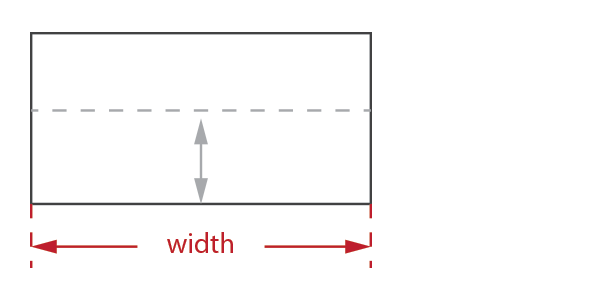

Fixes the horizontal size of an enclosed element (`subject`).

#### Expression

```c++
hsize(width, subject)
```

#### Notation

| `width`      | `float`               |
| `subject`    | Instance of `Element` |

#### Semantics
1. `subject` will be laid out with a fixed `width`, constrained by the
   natural *horizontal limits* of the `subject` (the natural *horizontal
   limits* of the element will not be violated).
2. The natural *vertical limits* of `subject` will not be affected.
2. Returns instance of `Proxy`.

-------------------------------------------------------------------------------

### vsize


Fixes the *vertical limits* of an enclosed element (`subject`).

#### Expression

```c++
vsize(height, subject)
```

#### Notation

| `height`     | `float`               |
| `subject`    | Instance of `Element` |

#### Semantics
1. `subject` will be laid out with a fixed `height`, constrained by the
   natural *vertical limits* of the `subject` (the natural *vertical limits*
   of the element will not be violated).
2. The natural *horizontal limits* of `subject` will not be affected.
2. Returns instance of `Proxy`.

-------------------------------------------------------------------------------

### min_size


Overrides the *minimum limits* of an enclosed element (`subject`).

#### Expression

```c++
min_size({ width, height }, subject)
```

#### Notation

| `width`, `height`  | `float`               |
| `subject`          | Instance of `Element` |

#### Semantics
1. The *minimum limits* of `subject` will be set to the specified `width` and
   `height`, constrained by the natural *minimum limits* of the `subject`.
2. the natural *minimum limits* of the element will not be violated.
2. Returns instance of `Proxy`.

-------------------------------------------------------------------------------

### hmin_size


Overrides the *minimum horizontal limit* of an enclosed element (`subject`).

#### Expression

```c++
hmin_size(width, subject)
```

#### Notation

| `width`      | `float`               |
| `subject`    | Instance of `Element` |

#### Semantics
1. The *minimum horizontal limit* of `subject` will be set to the specified
   `width` constrained by the natural *horizontal minimum limits* of the
   `subject`.
2. The natural *horizontal minimum limits* of the element will not be
   violated.
2. Returns instance of `Proxy`.

-------------------------------------------------------------------------------

### vmin_size

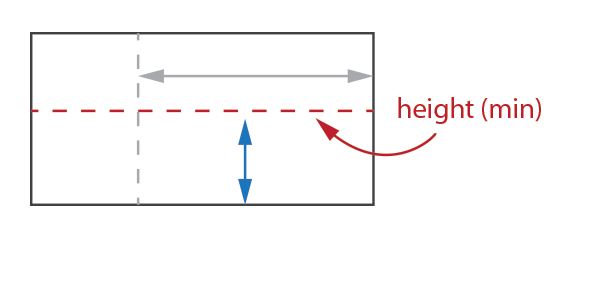

Overrides the *minimum vertical limit* of an enclosed element (`subject`).

#### Expression

```c++
vmin_size(height, subject)
```

#### Notation

| `height`     | `float`               |
| `subject`    | Instance of `Element` |

#### Semantics
1. The *minimum vertical limit* of `subject` will be set to the specified `height`
   constrained by the natural vertical *minimum limits* of the `subject`.
2. The natural vertical *minimum limits* of the element will not be violated.
2. Returns instance of `Proxy`.

-------------------------------------------------------------------------------

### max_size


Overrides the *maximum limits* of an enclosed element (`subject`).

#### Expression

```c++
max_size({ width, height }, subject)
```

#### Notation

| `width`, `height`  | `float`               |
| subject            | Instance of `Element` |

#### Semantics
1. The *maximum limits* of `subject` will be set to the specified `width` and
   `height`, constrained by the natural *maximum limits* of the `subject`.
2. The natural *maximum limits* of the element will not be violated.
2. Returns instance of `Proxy`.

-------------------------------------------------------------------------------

### hmax_size

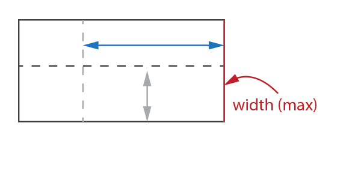

Overrides the *maximum horizontal limit* of an enclosed element (`subject`).

#### Expression

```c++
hmax_size(width, subject)
```

#### Notation

| `width`      | `float`               |
| `subject`    | Instance of `Element` |

#### Semantics
1. The *maximum horizontal limit* of `subject` will be set to the specified
   `width` constrained by the natural *maximum horizontal limit* of the
   `subject`.
2. The natural *maximum horizontal limit* of the element will not be
   violated.
2. Returns instance of `Proxy`.

-------------------------------------------------------------------------------

### vmax_size


Overrides the *maximum vertical limit* of an enclosed element (`subject`).

#### Expression

```c++
vmax_size(height, subject)
```

#### Notation

| `height`     | `float`               |
| `subject`    | Instance of `Element` |

#### Semantics
1. The *maximum vertical limit* of `subject` will be set to the specified
   `height` constrained by the natural *maximum vertical limit* of the
   `subject`
2. The natural *maximum vertical limit* of the element will not be violated.
2. Returns instance of `Proxy`.

-------------------------------------------------------------------------------

## Stretch Elements

Resizable elements are elements with *minimum limits* that are less than the
*maximum limits* in either x or y dimensions or both. Resizable elements can
therefore stretch if there is extra available space allocated to it beyond
its minimum limit. When two or more resizable elements are placed side by
side in an [htile](#htile) or [vtile](#vtile), the element's "stretchiness"
determines how much extra space is given to it. The element's "stretchiness"
is determined by the element's `stretch` member function:

```c++
virtual view_stretch stretch() const;
```

where `view_stretch` is a struct declared as:

```c++
struct view_stretch
{
   float    x = 1.0;
   float    y = 1.0;
};
```

The `view_stretch` `x` and `y` members determine how much an element can
stretch in the x or y dimensions. The default is 1.0. A stretchiness value of
2.0 means that the element is able to stretch twice as much compared to its
siblings in an [htile](#htile) or [vtile](#vtile), assuming they have the
default 1.0 stretchiness.

-------------------------------------------------------------------------------

### hstretch

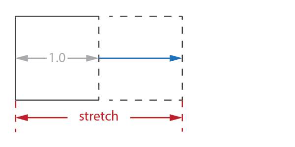

Overrides the horizontal stretchiness of an an enclosed element (`subject`).

#### Expression

```c++
hstretch(stretch, subject)
```

#### Notation

| `stretch`    | A scalar value        |
| `subject`    | Instance of `Element` |

#### Semantics
1. The `subject` will assume the given `stretch` value.
2. The stretch value has no effect to elements with fixed horizontal size.
2. Returns instance of `Proxy`.

For example, the image below shows how three elements are laid out in an
`htile`, with stretch values of `1.0`, `1.0` and `2.0`, respectively:

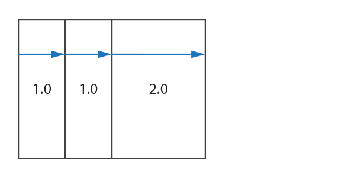

The element with the `2.0` stretch value stretches twice as much compared to
its siblings.

-------------------------------------------------------------------------------

### vstretch

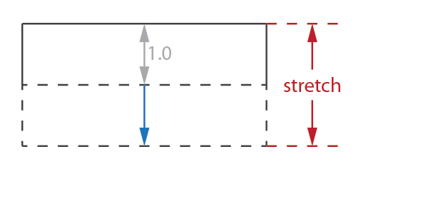

Overrides the vertical stretchiness of an an enclosed element (`subject`).

#### Expression

```c++
vstretch(stretch, subject)
```

#### Notation

| `stretch`    | A scalar value        |
| `subject`    | Instance of `Element` |

#### Semantics
1. The `subject` will assume the given `stretch` value.
2. The stretch value has no effect to elements with fixed *vertical limits*.
2. Returns instance of `Proxy`.

For example, the image below shows how three elements are laid out in an
`htile`, with stretch values of `0.5`, `1.0` and `1.5`, respectively:


The element with the `0.5` stretch value stretches half less, while the
element with the `1.5` stretches half more than the default.

-------------------------------------------------------------------------------

## Scale Element

The Elements Library is resolution independent and elements can be scaled up
or down to suit. The default scale is 1.0 (no scale).

-------------------------------------------------------------------------------

### scale

The `scale` element changes the scale of its enclosed element (`subject`).

#### Expression

```c++
scale(scale_, subject)
```

#### Notation

| `scale_`     | `float`               |
| `subject`    | Instance of `Element` |

#### Semantics
1. The `subject` will scaled given the `scale_` value. A value > 1.0 scales
   the element up (zoom in), while a value < 1.0 scales down (zoom out).
2. Returns instance of `Proxy`.

-------------------------------------------------------------------------------

## Align Elements

An element can be aligned arbitrarily from 0.0 to 1.0 in either the x or y
dimensions, or both. There is a comprehensive list of align elements in The
Elements Library that can be used for various purposes. This section
catalogues all the available align elements.

-------------------------------------------------------------------------------

### halign


Aligns the an enclosed element (`subject`) in the x-axis.

#### Expression

```c++
halign(align, subject)
```

#### Notation

| `align`      | `float`               |
| `subject`    | Instance of `Element` |

#### Semantics
1. Given a total allocated space `X`, `subject` will be positioned
   horizontally to `X * align`.
2. The `subject` will assume its *minimum horizontal limit*.
3. Returns instance of `Proxy`.

#### Examples
1. `halign(0.0) // align subject to the left`
2. `halign(1.0) // align subject to the right`
3. `halign(0.5) // align subject to the center`

-------------------------------------------------------------------------------

### align_left


Left-aligns the an enclosed element (`subject`).

#### Expression

```c++
align_left(subject)
```

#### Notation

| `subject`    | Instance of `Element` |

#### Semantics
1. Equivalent to `halign(0.0, subject)`
2. Returns instance of `Proxy`.

-------------------------------------------------------------------------------

### align_center

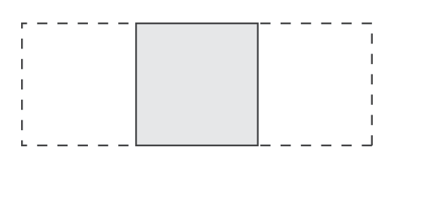

Center-aligns the an enclosed element (`subject`).

#### Expression

```c++
align_center(subject)
```

#### Notation

| `subject`    | Instance of `Element` |

#### Semantics
1. Equivalent to `halign(0.5, subject)`
2. Returns instance of `Proxy`.

-------------------------------------------------------------------------------

### align_right

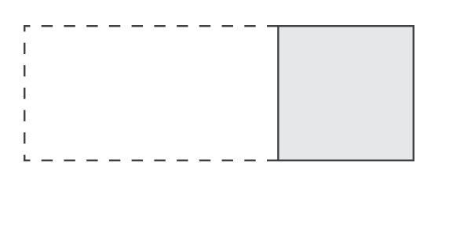

Right-aligns the an enclosed element (`subject`).

#### Expression

```c++
align_right(subject)
```

#### Notation

| `subject`    | Instance of `Element` |

#### Semantics
1. Equivalent to `halign(1.0, subject)`
2. Returns instance of `Proxy`.

-------------------------------------------------------------------------------

### valign

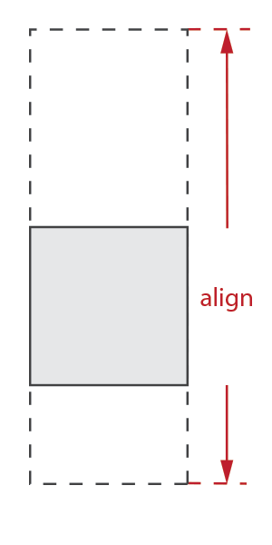

Aligns the an enclosed element (`subject`) in the y-axis.

#### Expression

```c++
valign(align, subject)
```

#### Notation

| `align`      | `float`               |
| `subject`    | Instance of `Element` |

#### Semantics
1. Given a total allocated space `Y`, `subject` will be positioned vertically
   to `Y * align`.
2. The `subject` will assume its *minimum vertical limit*.
3. Returns instance of `Proxy`.

#### Examples
1. `valign(0.0) // align subject to the top`
2. `valign(1.0) // align subject to the right`
3. `valign(0.5) // align subject to the middle`

-------------------------------------------------------------------------------

### align_top


Aligns the an enclosed element (`subject`) to the top.

#### Expression

```c++
align_top(subject)
```

#### Notation

| `subject`    | Instance of `Element` |

#### Semantics
1. Equivalent to `valign(0.0, subject)`
2. Returns instance of `Proxy`.

-------------------------------------------------------------------------------

### align_middle


Aligns the an enclosed element (`subject`) to the middle.

#### Expression

```c++
align_middle(subject)
```

#### Notation

| `subject`    | Instance of `Element` |

#### Semantics
1. Equivalent to `valign(0.5, subject)`
2. Returns instance of `Proxy`.

-------------------------------------------------------------------------------

### align_bottom


Aligns the an enclosed element (`subject`) to the bottom.

#### Expression

```c++
align_bottom(subject)
```

#### Notation

| `subject`    | Instance of `Element` |

#### Semantics
1. Equivalent to `valign(1.0, subject)`
2. Returns instance of `Proxy`.

-------------------------------------------------------------------------------

### align_left_top

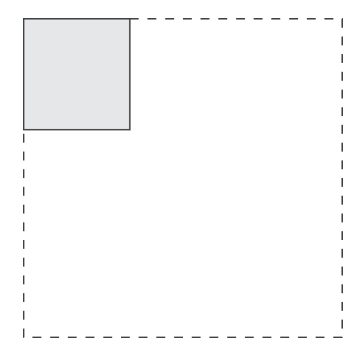

Aligns the an enclosed element (`subject`) to the left-top.

#### Expression

```c++
align_left_top(subject)
```

#### Notation

| `subject`    | Instance of `Element` |

#### Semantics
1. Equivalent to `align_left(align_top(subject))`
2. Returns instance of `Proxy`.

-------------------------------------------------------------------------------

### align_center_top

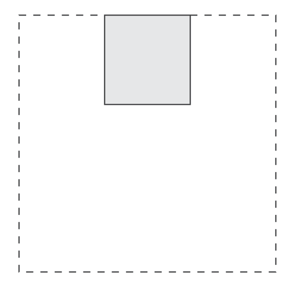

Aligns the an enclosed element (`subject`) to the center-top.

#### Expression

```c++
align_center_top(subject)
```

#### Notation

| `subject`    | Instance of `Element` |

#### Semantics
1. Equivalent to `align_center(align_top(subject))`
2. Returns instance of `Proxy`.

-------------------------------------------------------------------------------

### align_right_top

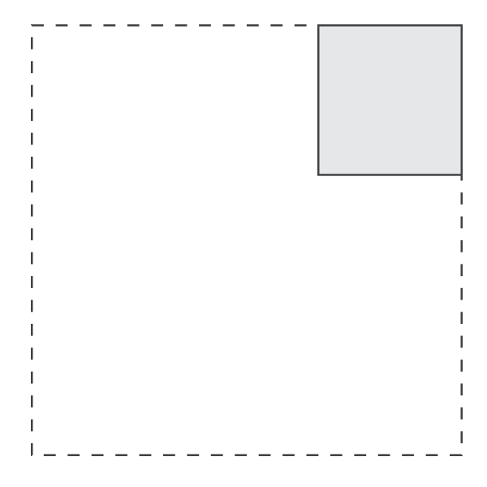

Aligns the an enclosed element (`subject`) to the right-top.

#### Expression

```c++
align_right_top(subject)
```

#### Notation

| `subject`    | Instance of `Element` |

#### Semantics
1. Equivalent to `align_right(align_top(subject))`
2. Returns instance of `Proxy`.

-------------------------------------------------------------------------------

### align_left_middle

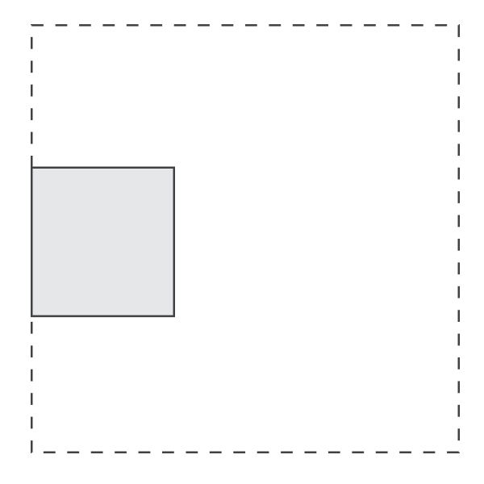

Aligns the an enclosed element (`subject`) to the left-middle.

#### Expression

```c++
align_left_middle(subject)
```

#### Notation

| `subject`    | Instance of `Element` |

#### Semantics
1. Equivalent to `align_left(align_middle(subject))`
2. Returns instance of `Proxy`.

-------------------------------------------------------------------------------

### align_center_middle


Aligns the an enclosed element (`subject`) to the center-middle.

#### Expression

```c++
align_center_middle(subject)
```

#### Notation

| `subject`    | Instance of `Element` |

#### Semantics
1. Equivalent to `align_center(align_middle(subject))`
2. Returns instance of `Proxy`.

-------------------------------------------------------------------------------

### align_right_middle

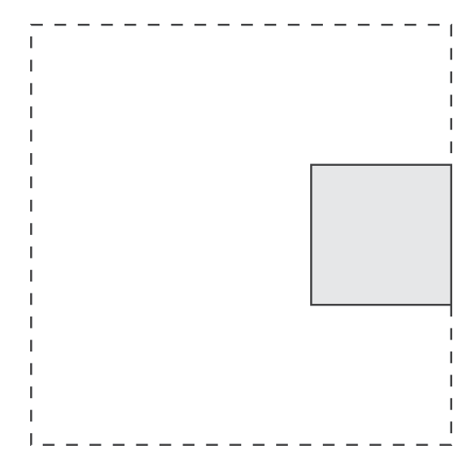

Aligns the an enclosed element (`subject`) to the right-middle.

#### Expression

```c++
align_right_middle(subject)
```

#### Notation

| `subject`    | Instance of `Element` |

#### Semantics
1. Equivalent to `align_right(align_middle(subject))`
2. Returns instance of `Proxy`.

-------------------------------------------------------------------------------

### align_left_bottom

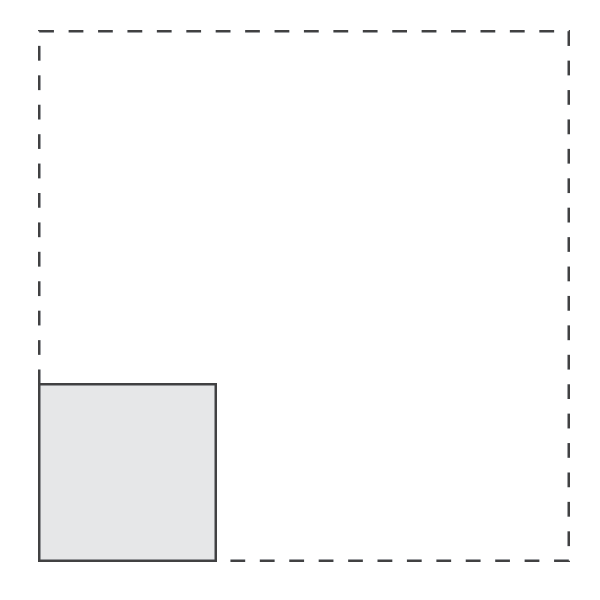

Aligns the an enclosed element (`subject`) to the left-bottom.

#### Expression

```c++
align_left_bottom(subject)
```

#### Notation

| subject   | Instance of `Element` |

#### Semantics
1. Equivalent to `align_left(align_bottom(subject))`
2. Returns instance of `Proxy`.

-------------------------------------------------------------------------------

### align_center_bottom

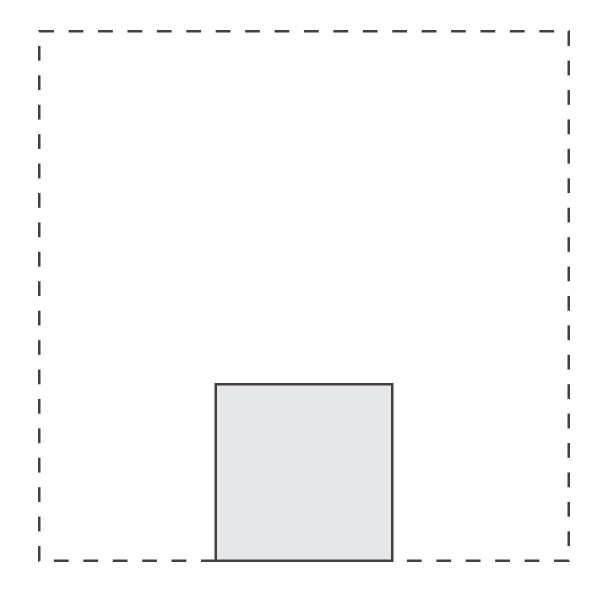

Aligns the an enclosed element (`subject`) to the center-bottom.

#### Expression

```c++
align_center_bottom(subject)
```

#### Notation

| `subject`    | Instance of `Element` |

#### Semantics
1. Equivalent to `align_center(align_bottom(subject))`
2. Returns instance of `Proxy`.

-------------------------------------------------------------------------------

### align_right_bottom

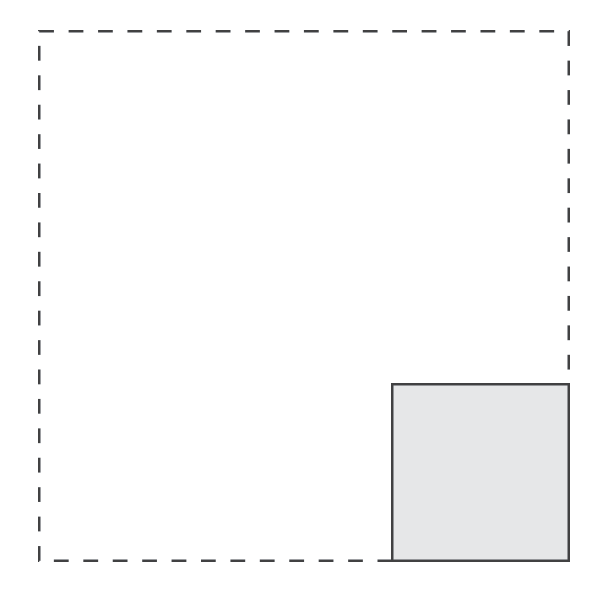

Aligns the an enclosed element (`subject`) to the right-bottom.

#### Expression

```c++
align_right_bottom(subject)
```

#### Notation

| `subject`    | Instance of `Element` |

#### Semantics
1. Equivalent to `align_right(align_bottom(subject))`
2. Returns instance of `Proxy`.

-------------------------------------------------------------------------------

## Margin Elements

Margins add some space around elements. There is a comprehensive list of
margin elements in the Elements Library that can be used for various
purposes. This section catalogues all the available margin elements.

-------------------------------------------------------------------------------

### margin


Adds a margin all around an enclosed element (`subject`).

#### Expression

```c++
margin({ left, top, right, bottom }, subject)
```

#### Notation

| `left`, `top`, `right`, `bottom`  | `float`               |
| `subject`                         | Instance of `Element` |

#### Semantics
1. Space is added to the left, top, right, and bottom of the subject with the
   given parameters.
2. The element's *limits* is overridden to account for the additional space.
3. The `margin` does not violate the natural *limits* of the subject.
   `margin` will respect the subject's min-max constraints and resizability.
4. Returns instance of `Proxy`.

-------------------------------------------------------------------------------

### left_margin


Adds a margin to the left of an enclosed element (`subject`).

#### Expression

```c++
left_margin(left, subject)
```

#### Notation

| `left`       | `float`               |
| `subject`    | Instance of `Element` |

#### Semantics
1. Space is added to the left of the subject with the given parameter.
2. The element's *limits* is overridden to account for the additional space.
3. The `left_margin` does not violate the natural *limits* of the subject.
   `left_margin` will respect the subject's min-max constraints and
   resizability.
4. Returns instance of `Proxy`.

-------------------------------------------------------------------------------

### right_margin


Adds a margin to the right of an enclosed element (`subject`).

#### Expression

```c++
right_margin(right, subject)
```

#### Notation

| `right`      | `float`               |
| `subject`    | Instance of `Element` |

#### Semantics
1. Space is added to the right of the subject with the given parameter.
2. The element's *limits* is overridden to account for the additional space.
3. The `right_margin` does not violate the natural *limits* of the subject.
   `right_margin` will respect the subject's min-max constraints and
   resizability.
4. Returns instance of `Proxy`.

-------------------------------------------------------------------------------

### top_margin

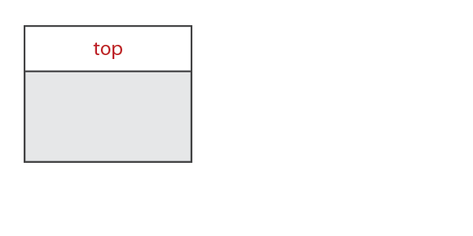

Adds a margin to the top of an enclosed element (`subject`).

#### Expression

```c++
top_margin(top, subject)
```

#### Notation

| `top`        | `float`               |
| `subject`    | Instance of `Element` |

#### Semantics
1. Space is added to the top of the subject with the given parameter.
2. The element's *limits* is overridden to account for the additional space.
3. The `top_margin` does not violate the natural *limits* of the subject.
   `top_margin` will respect the subject's min-max constraints and
   resizability.
4. Returns instance of `Proxy`.

-------------------------------------------------------------------------------

### bottom_margin

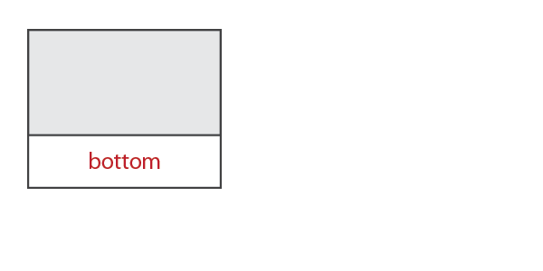

Adds a margin to the bottom of an enclosed element (`subject`).

#### Expression

```c++
bottom_margin(bottom, subject)
```

#### Notation

| `bottom`     | `float`               |
| `subject`    | Instance of `Element` |

#### Semantics
1. Space is added to the to the bottom of the subject with the given
   parameter.
2. The element's *limits* is overridden to account for the additional space.
3. The `bottom_margin` does not violate the natural *limits* of the subject.
   `bottom_margin` will respect the subject's min-max constraints and
   resizability.
4. Returns instance of `Proxy`.

-------------------------------------------------------------------------------

### hmargin
(same as `left_right_margin`)


Adds a margin to the left and right sides of an enclosed element (`subject`).

#### Expressions

```c++
// variant 1
hmargin({ left, right }, subject)

// variant 2
hmargin(left, right, subject)

// variant 3
left_right_margin({ left, right }, subject)

// variant 4
left_right_margin(left, right, subject)
```

#### Notation

| `left`, `right`    | `float`               |
| `subject`          | Instance of `Element` |

#### Semantics
1. Space is added to the to the left and right sides of the subject with the
   given parameters.
2. The element's *limits* is overridden to account for the additional space.
3. The `hmargin` (and variants) does not violate the natural *limits* of the
   subject. `hmargin` (and variants) will respect the subject's min-max
   constraints and resizability.
4. Returns instance of `Proxy`.

-------------------------------------------------------------------------------

### vmargin
(same as `top_bottom_margin`)


Adds a margin to the top and bottom sides of an enclosed element (`subject`).

#### Expressions

```c++
// variant 1
vmargin({ top, bottom }, subject)

// variant 2
vmargin(top, bottom, subject)

// variant 3
top_bottom_margin({ top, bottom }, subject)

// variant 4
top_bottom_margin(top, bottom, subject)
```

#### Notation

| `top`, `bottom`    | `float`               |
| `subject`          | Instance of `Element` |

#### Semantics
1. Space is added to the to the top and bottom sides of the subject with the
   given parameters.
2. The element's *limits* is overridden to account for the additional space.
3. The `vmargin` (and variants) does not violate the natural *limits* of the
   subject. `vmargin` (and variants) will respect the subject's min-max
   constraints and resizability.
4. Returns instance of `Proxy`.

-------------------------------------------------------------------------------

### left_top_margin


Adds a margin to the left and top sides of an enclosed element (`subject`).

#### Expressions

```c++
// variant 1
left_top_margin({ left, top }, subject)

// variant 2
left_top_margin(left, top, subject)
```

#### Notation

| `left`, `top`      | `float`               |
| `subject`          | Instance of `Element` |

#### Semantics
1. Space is added to the to the left and top sides of the subject with the
   given parameters.
2. The element's *limits* is overridden to account for the additional space.
3. The `left_top_margin` (and variant) does not violate the natural *limits*
   of the subject. `left_top_margin` (and variant) will respect the subject's
   min-max constraints and resizability.
4. Returns instance of `Proxy`.

-------------------------------------------------------------------------------

### left_bottom_margin


Adds a margin to the left and bottom sides of an enclosed element (`subject`).

#### Expressions

```c++
// variant 1
left_bottom_margin({ left, bottom }, subject)

// variant 2
left_bottom_margin(left, bottom, subject)
```

#### Notation

| `left`, `bottom`   | `float`               |
| `subject`          | Instance of `Element` |

#### Semantics
1. Space is added to the to the left and bottom sides of the subject with the
   given parameters.
2. The element's *limits* is overridden to account for the additional space.
3. The `left_bottom_margin` (and variant) does not violate the natural
   *limits* of the subject. `left_bottom_margin` (and variant) will respect
   the subject's min-max constraints and resizability.
4. Returns instance of `Proxy`.

-------------------------------------------------------------------------------

### right_top_margin


Adds a margin to the right and top sides of an enclosed element (`subject`).

#### Expressions

```c++
// variant 1
right_top_margin({ right, top }, subject)

// variant 2
right_top_margin(right, top, subject)
```

#### Notation

| `right`, `top`     | `float`               |
| `subject`          | Instance of `Element` |

#### Semantics
1. Space is added to the to the right and top sides of the subject with the
   given parameters.
2. The element's *limits* is overridden to account for the additional space.
3. The `right_top_margin` (and variant) does not violate the natural *limits*
   of the subject. `right_top_margin` (and variant) will respect the
   subject's min-max constraints and resizability.
4. Returns instance of `Proxy`.

-------------------------------------------------------------------------------

### right_bottom_margin


Adds a margin to the right and bottom sides of an enclosed element (`subject`).

#### Expressions

```c++
// variant 1
right_bottom_margin({ right, bottom }, subject)

// variant 2
right_bottom_margin(right, bottom, subject)
```

#### Notation

| `right`, `bottom`  | `float`               |
| `subject`          | Instance of `Element` |

#### Semantics
1. Space is added to the to the right and bottom sides of the subject with the
   given parameters.
2. The element's *limits* is overridden to account for the additional space.
3. The `right_bottom_margin` (and variant) does not violate the natural
   limits of the subject. `right_bottom_margin` (and variant) will respect
   the subject's min-max constraints and resizability.
4. Returns instance of `Proxy`.

-------------------------------------------------------------------------------

## Floating

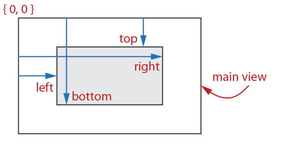

A floating element allows arbitrary placement of an enclosed element
(`subject`) in the main view.

#### Expression

```c++
floating({ left, top, right, bottom }, subject)
```

#### Notation

| `left`, `top`, `right`, `bottom`  | `float`               |
| `subject`                         | Instance of `Element` |

#### Semantics
1. The element will be placed exactly to the specified position in the main
   view, constrained to the subject's natural *limits*.
2. The floating element does not violate the natural *limits* of the subject.
4. Returns instance of `Proxy`.

-------------------------------------------------------------------------------

## Tiles and Grids

Tiles are the most useful layout elements, followed by by Grids. Tiles are
used everywhere for composing hierarchical elements in rows and columns,
typical to all GUIs. Grids are similar to tiles. Both tiles and grids allow
elements to fluidly adjust depending on available space. Tiles compute the
layout of its elements using the children elements' size `limits` while grids
lay out its elements using an externally supplied fractional coordinates that
specify positions of the elements in the allocated space.

Tiles are best used
for composing UI elements while grids are best for composing tables.

-------------------------------------------------------------------------------

### Horizontal Grids


Horizontal Grids are composites that lay out one or more child elements in a
row following externally supplied horizontal fractional positions. Horizontal
Grids have computed horizontal and vertical sizes following the natural
`limits` of its children.

#### Semantics
1. The elements are laid out in a single row, left to right, immediately next
   to each other with no intervening space.
2. The elements are positioned horizontally using the supplied fractional
   positions. The fractional positions values range from 0.0 to 1.0, which
   specify the child element's horizontal position from left (0.0) to right
   (1.0).
3. The grid's *minimum vertical limit* is computed as the maximum of the
   children elements' *minimum vertical limit*s.
4. The grid's *maximum vertical limit* is computed as the minimum of the
   children elements' *maximum vertical limit*s.
5. The final computed minimum limit is clamped to ensure it is not greater
   than the computed maximum limit. Likewise the computed maximum limit is
   clamped to ensure it is not less than the computed minimum limit.
6. The supplied (horizontal) positions and computed (vertical) coordinates
   may violate the limits of its children elements.
   1. If the allocated size of a child element is lower than the element's
      *minimum limits* in either dimension, the element will be cropped.
   2. If a child element's *maximum limits* in either dimension is exceeded,
      the element will be aligned to the top-left.

-------------------------------------------------------------------------------

### hgrid

Build a horizontal grid with a fixed number of elements.

#### Expression

```c++
hgrid(positions, e1,...eN)
```

#### Notation

| `N`             | The number of items                                             |
| `e1,...eN`      | One or more child elements, instances of `Element` (more below) |
| `positions`     | External container of fractional positions (more below)         |

The external container, `positions`, can either be a plain array of type
`float[N]` or `std::array<float, N>`. Elements `e1,...eN` are held in a
`std::array<element_ptr, N>` managed by the horizontal grid element.

#### Example

```c++
static float positions[] = { 0.25, 0.5, 0.75, 1.0 };
//...
hgrid(positions, item1, item2, item3, item4)
```

> :point_right: If the number of elements is not fixed, you can use an
`hgrid_composite` (see below).

#### Requirements
1. The number of supplied positions and elements should match, otherwise,
   compiler error (no matching function for call to `hgrid`).
2. The positions assume the first element is at `x=0` (it is at the left-most
   position in the row). The fractional position of the second element is at
   index `0`, the third at index `1`, and so on.
3. The externally supplied positions should be sorted with increasing values
   such that positions[n] <= positions[n+1]. The behavior is undefined if
   this is violated.

#### Semantics
1. In addition to the semantics of Horizontal Grids, returns instance of
   `Composite`.

-------------------------------------------------------------------------------

### hgrid_composite

Create a horizontal grid with an indeterminate (dynamic) number of elements.

#### Expression

```c++
hgrid_composite c{ positions };
```

#### Notation

| `positions`     | External container of fractional positions, `std::vector<float>` |
| `c`             | Instance of type `hgrid_composite`                                 |

The `hgrid_composite` is basically a `std::vector<element_ptr>` that the
client uses to manage the composite's elements. The lifetime of the
container, `c`, is the client's responsibility. You use `hgrid_composite`
just as you would a `std::vector`, such as `push_back` a child element. Just
keep in mind that we are dealing with `element_ptr` items.

#### Example

```c++
c.push_back(share(child));
```

> :point_right: `share` turns an element object into an `element_ptr` held by
> the `std::vector<element_ptr>` in `hgrid_composite`.

`hgrid_composite` is itself also an `element` and while it has `std::vector`'s
interface, it can also be `share`d like any element, which allows you to
build complex hierarchical structures.

#### Requirements
1. The number of items in the external coordinates vector `positions` must match
   with the number of elements at any given time.
2. The positions assume the first element is at `x=0` (it is at the left-most
   position in the row). The fractional position of the second element is at
   index `0`, the third at index `1`, and so on.
3. The externally supplied positions should be sorted with increasing values
   such that positions[n] <= positions[n+1]. The behavior is undefined if
   this is violated.

-------------------------------------------------------------------------------

### Horizontal Tiles


Horizontal Tiles are similar to Horizontal Grids, but allow elements to
fluidly adjust horizontally depending on available space. Horizontal Tiles
are best used for composing UI elements while Horizontal Grids are best for
composing tables.

#### Semantics
1. The elements are laid out in a single row, left to right, immediately next
   to each other with no intervening space.
2. The elements are positioned horizontally using the children's natural
   *limits*.
3. Horizontal space is allocated using this algorithm:
   1. Space is allocated for each child element following the child's natural
      *minimum horizontal limit*.
   2. If the allocated space exceeds the sum of all children elements'
      *minimum horizontal limit*s, the extra space is given to each
      horizontally resizable element (`limits.min.x < limits.max.x`).
   3. The element's "stretchiness" determines how much extra space is given
      to it according to the element's `stretch()` member function. A stretch
      value of `1.0` is default. A stretchiness value of 2.0 means that the
      element is able to stretch twice as much compared to its siblings.
      Horizontally fixed-sized elements will not be stretched (element d in
      the diagram). (Also see [Stretch Elements](#stretch-elements)).
3. The tile's *minimum vertical limit* is computed as the maximum of the
   children elements' *minimum vertical limit*s.
4. The grid's *maximum vertical limit* is computed as the minimum of the
   children elements' *maximum vertical limit*s.
5. The final computed minimum limit is clamped to ensure it is not greater
   than the computed maximum limit. Likewise the computed maximum limit is
   clamped to ensure it is not less than the computed minimum limit.
6. The supplied (horizontal) and computed (vertical) coordinates may violate
   the limits of its children elements.
   1. If the allocated size of a child element is lower than the element's
      *minimum limits* in either dimension, the element will be cropped.
   2. If a child element's *maximum limits* in either dimension is exceeded,
      the element will be aligned to the top-left.

-------------------------------------------------------------------------------

### htile

Build a horizontal tile with a fixed number of elements.

#### Expression

```c++
htile(e1,...eN)
```

#### Notation

| `N`             | The number of items                                          |
| `e1,...eN`      | One or more child elements, instances of `Element` (more below)|

Elements `e1,...eN` are held in a `std::array<element_ptr, N>` managed by the
horizontal tile element.

#### Example:

```c++
htile(item1, item2, item3, item4)
```

> :point_right: If the number of elements is not fixed, you can use an
`htile_composite` (see below).

#### Semantics
1. In addition to the semantics of Horizontal Tiles, returns instance of
   `Composite`.

-------------------------------------------------------------------------------

### htile_composite

Create a horizontal tile with an indeterminate (dynamic) number of elements.

#### Expression

```c++
htile_composite c;
```

#### Notation

| `c`             | Instance of type `htile_composite`   |

The `htile_composite` is basically a `std::vector<element_ptr>` that the
client uses to manage the composite's elements. The lifetime of the
container, `c`, is the client's responsibility. You use `htile_composite`
just as you would a `std::vector`, such as `push_back` a child element. Just
keep in mind that we are dealing with `element_ptr` items.

#### Example

```c++
c.push_back(share(child));
```

> :point_right: `share` turns an element object into an `element_ptr` held by
> the `std::vector<element_ptr>` in `htile_composite`.

`htile_composite` is itself also an `element` and while it has `std::vector`'s
interface, it can also be `share`d like any element, which allows you to
build complex hierarchical structures.

-------------------------------------------------------------------------------

### Vertical Grids

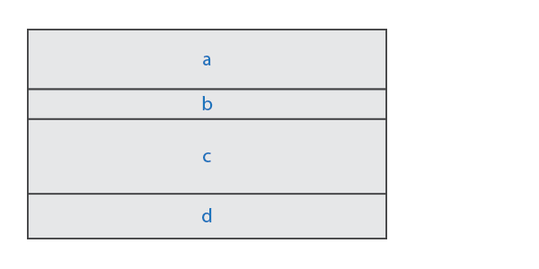

Vertical Grids are composites that lay out one or more child elements in a
column following externally supplied vertical fractional positions. Vertical
Grids have computed horizontal and vertical sizes following the natural
`limits` of its children.

#### Semantics
1. The elements are laid out in a single column, top to bottom, immediately
   next to each other with no intervening space.
2. The elements are positioned vertically using the supplied fractional
   positions. The fractional positions values range from 0.0 to 1.0, which
   specify the child element's vertical position from top (0.0) to bottom
   (1.0).
3. The grid's *minimum horizontal limit* is computed as the maximum of the
   children elements' *minimum horizontal limit*s.
4. The grid's *maximum horizontal limit* is computed as the minumum of the
   children elements' *maximum horizontal limit*s.
5. The final computed minimum limit is clamped to ensure it is not greater
   than the computed maximum limit. Likewise the computed maximum limit is
   clamped to ensure it is not less than the computed minimum limit.
6. The supplied (vertical) positions and computed (horizontal) coordinates
   may violate the limits of its children elements.
   1. If the allocated size of a child element is lower than the element's
      *minimum limits* in either dimension, the element will be cropped.
   2. If a child element's *maximum limits* in either dimension is exceeded,
      the element will be aligned to the top-left.

-------------------------------------------------------------------------------

### vgrid

Build a vertical grid with a fixed number of elements.

#### Expression

```c++
vgrid(positions, e1,...eN)
```

#### Notation

| `N`             | The number of items                                             |
| `e1,...eN`      | One or more child elements, instances of `Element` (more below) |
| `positions`     | External container of fractional positions (more below)         |


The External container, `positions` is an external can either be a plain array
of type `float[N]` or `std::array<float, N>`. Elements `e1,...eN` are held in
a `std::array<element_ptr, N>` managed by the vertical grid element.

#### Example

```c++
static float positions[] = { 0.25, 0.5, 0.75, 1.0 };
//...
vgrid(positions, item1, item2, item3, item4)
```

> :point_right: If the number of elements is not fixed, you can use an
`vgrid_composite` (see below).

#### Requirements
1. The number of supplied coordinates and elements should match, otherwise,
   compiler error (no matching function for call to `vgrid`).
2. The positions assume the first element is at `x=0` (it is at the top-most
   position in the column). The fractional position of the second element is at
   index `0`, the third at index `1`, and so on.
3. The externally supplied positions should be sorted with increasing values
   such that positions[n] <= positions[n+1]. The behavior is undefined if
   this is violated.

#### Semantics
1. In addition to the semantics of Vertical Grids, returns instance of
   `Composite`.

-------------------------------------------------------------------------------

### vgrid_composite

Create a vertical grid with an indeterminate (dynamic) number of elements.

#### Expression

```c++
vgrid_composite c{ positions };
```

#### Notation

| `positions`     | External container of fractional positions, `std::vector<float>`   |
| `c`             | Instance of type `vgrid_composite`                                 |

The `vgrid_composite` is basically a `std::vector<element_ptr>` that the
client uses to manage the composite's elements. The lifetime of the
container, `c`, is the client's responsibility. You use `vgrid_composite`
just as you would a `std::vector`, such as `push_back` a child element. Just
keep in mind that we are dealing with `element_ptr` items. Example:

```c++
c.push_back(share(child));
```

> :point_right: `share` turns an element object into an `element_ptr` held by
> the `std::vector<element_ptr>` in `vgrid_composite`.

`vgrid_composite` is itself also an `element` and while it has `std::vector`'s
interface, it can also be `share`d like any element, which allows you to
build complex hierarchical structures.

#### Requirements
1. The number of items in the external coordinates vector `positions` must match
   with the number of elements at any given time.
2. The positions assume the first element is at `x=0` (it is at the top-most
   position in the column). The fractional position of the second element is at
   index `0`, the third at index `1`, and so on.
3. The externally supplied positions should be sorted with increasing values
   such that positions[n] <= positions[n+1]. The behavior is undefined if
   this is violated.

-------------------------------------------------------------------------------

### Vertical Tiles

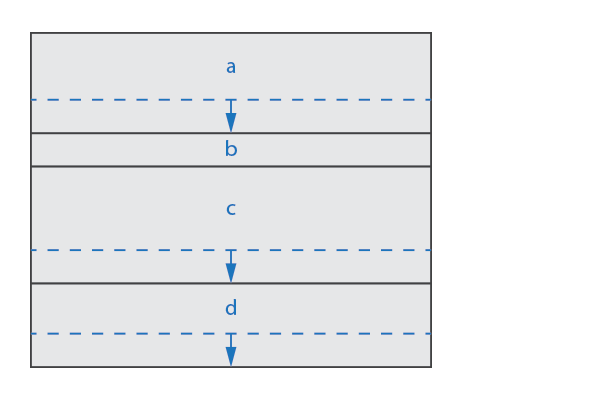

Vertical Tiles are similar to Vertical Grids, but allow elements to fluidly
adjust vertically depending on available space. Vertical Tiles are best used
for composing UI elements while Vertical Grids are best for composing tables.

#### Semantics
1. The elements are laid out in a single column, left to right, immediately
   next to each other with no intervening space.
2. The elements are positioned vertically using the children's natural
   *limits*.
3. Vertical space is allocated using this algorithm:
   1. Space is allocated for each child element following the child's natural
      *minimum vertical limit*.
   2. If the allocated space exceeds the sum of all children elements'
      *minimum vertical limit*s, the extra space is given to each
      vertically resizable element (`limits.min.y < limits.max.y`).
   3. The element's "stretchiness" determines how much extra space is given
      to it according to the element's `stretch()` member function. A stretch
      value of `1.0` is default. A stretchiness value of 2.0 means that the
      element is able to stretch twice as much compared to its siblings.
      Vertically fixed-sized elements will not be stretched (element b in the
      diagram). (Also see [Stretch Elements](#stretch-elements)).
3. The tile's *minimum horizontal limit* is computed as the maximum of the
   children elements' *minimum horizontal limit*s.
4. The grid's *maximum horizontal limit* is computed as the minumum of the
   children elements' *maximum horizontal limit*s.
5. The final computed minimum limit is clamped to ensure it is not greater
   than the computed maximum limit. Likewise the computed maximum limit is
   clamped to ensure it is not less than the computed minimum limit.
6. The supplied (vertical) and computed (horizontal) coordinates may violate
   the limits of its children elements.
   1. If the allocated size of a child element is lower than the element's
      *minimum limits* in either dimension, the element will be cropped.
   2. If a child element's *maximum limits* in either dimension is exceeded,
      the element will be aligned to the top-left.

-------------------------------------------------------------------------------

### vtile

Build a vertical tile with a fixed number of elements.

#### Expression

```c++
vtile(e1,...eN)
```

#### Notation

| `N`             | The number of items                                          |
| `e1,...eN`      | One or more child elements, instances of `Element` (more below)|

Elements `e1,...eN` are held in a `std::array<element_ptr, N>` managed by the
vertical tile element.

#### Example

```c++
vtile(item1, item2, item3, item4)
```

> :point_right: If the number of elements is not fixed, you can use an
`vtile_composite` (see below).

#### Semantics
1. In addition to the semantics of Vertical Tiles, returns instance of
   `Composite`.

-------------------------------------------------------------------------------

### vtile_composite

Create a vertical tile with an indeterminate (dynamic) number of elements:

#### Expression

```c++
vtile_composite c;
```

#### Notation

| `c`             | Instance of type `vtile_composite`   |

The `vtile_composite` is basically a `std::vector<element_ptr>` that the
client uses to manage the composite's elements. The lifetime of the
container, `c`, is the client's responsibility. You use `vtile_composite`
just as you would a `std::vector`, such as `push_back` a child element. Just
keep in mind that we are dealing with `element_ptr` items.

#### Example

```c++
c.push_back(share(child));
```

> :point_right: `share` turns an element object into an `element_ptr` held by
> the `std::vector<element_ptr>` in `vtile_composite`.

`vtile_composite` is itself also an `element` and while it has
`std::vector`'s interface, it can also be `share`d like any element, which
allows you to build complex hierarchical structures.

-------------------------------------------------------------------------------

## Layers


The Elements Library is 2D, but the z-axis pertains to top-to-bottom
layering. Layers allow groups of elements to be placed in the z-axis where
higher-level elements obscure or hide lower-level elements.

#### Semantics
1. The elements are laid out in the z-axis, top to bottom.
2. Rendering is done bottom-up; the bottom-most elements are drawn first.
3. UI control (such as mouse clicks) proceeds from top to bottom.
   Higher-level elements are given control priority. If a higher-level
   element does not process the event, lower-level elements are given a
   chance.
4. The layer's *minimum limit* is computed as the minimum of the children
   elements' *minimum limit*s.
5. The grid's *maximum limit* is computed as the maximum of the children
   elements' *maximum limit*s.
6. The final computed minimum limit is clamped to ensure it is not greater
   than the computed maximum limit. Likewise the computed maximum limit is
   clamped to ensure it is not less than the computed minimum limit.
7. The computed (vertical) and (horizontal) coordinates may violate the
   limits of its children elements.
   1. If the allocated size of a child element is lower than the element's
      *minimum limits* in either dimension, the element will be cropped.
   2. If a child element's *maximum limits* in either dimension is exceeded,
      the element will be aligned to the top-left.

-------------------------------------------------------------------------------

### layer

Create a layer composite with a fixed number of elements.

#### Expression

```c++
layer(e1,...eN)
```

#### Notation

| `N`             | The number of items                                          |
| `e1,...eN`      | One or more child elements, instances of `Element` (more below)|

Elements `e1,...eN` are held in a `std::array<element_ptr, N>` managed by the
layer element.

#### Example

```c++
layer(item1, item2, item3, item4)
```

> :point_right: If the number of elements is not fixed, you can use an
`layer_composite` (see below).

#### Semantics
1. In addition to the semantics of Layers, returns instance of `Composite`.

-------------------------------------------------------------------------------

### layer_composite

Create a layer with an indeterminate (dynamic) number of elements:

```c++
layer_composite c;
```

#### Notation

| `c`             | Instance of type `layer_composite`   |

The `layer_composite` is basically a `std::vector<element_ptr>` that the
client uses to manage the composite's elements. The lifetime of the
container, `c`, is the client's responsibility. You use `layer_composite`
just as you would a `std::vector`, such as `push_back` a child element. Just
keep in mind that we are dealing with `element_ptr` items.

#### Example

```c++
c.push_back(share(child));
```

> :point_right: `share` turns an element object into an `element_ptr` held by
> the `std::vector<element_ptr>` in `layer_composite`.

`layer_composite` is itself also an `element` and while it has
`std::vector`'s interface, it can also be `share`d like any element, which
allows you to build complex hierarchical structures.

-------------------------------------------------------------------------------

### Decks


The Deck is very similar to layers. Elements are placed in the z-axis. But
unlike layers, only selected element is active (top-most by default).

#### Semantics
1. Everything listed in the layer's *Semantics*, except 2 and 3.
2. Only the active selected element element is drawn.
3. Only the active selected element is given the chance to process UI control.

-------------------------------------------------------------------------------

### deck

Create a deck composite with a fixed number of elements.

#### Expression

```c++
deck(e1, e2, e3... eN)
```

#### Notation

| `N`             | The number of items                                          |
| `e1,...eN`      | One or more child elements, instances of `Element` (more below)|

Elements `e1,...eN` are held in a `std::array<element_ptr, N>` managed by the
deck element.

#### Example

```c++
deck(item1, item2, item3, item4)
```

> :point_right: If the number of elements is not fixed, you can use an
`deck_composite` (see below).

#### Requirements
1. In addition to the semantics of Deck, returns instance of `Composite`.

-------------------------------------------------------------------------------

### deck_composite

Create a deck with an indeterminate (dynamic) number of elements:

#### Expression

```c++
deck_composite c;
```

#### Notation

| `c`             | Instance of type `deck_composite`   |

The `deck_composite` is basically a `std::vector<element_ptr>` that the
client uses to manage the composite's elements. The lifetime of the
container, `c`, is the client's responsibility. You use `deck_composite`
just as you would a `std::vector`, such as `push_back` a child element. Just
keep in mind that we are dealing with `element_ptr` items.

#### Example

```c++
c.push_back(share(child));
```

> :point_right: `share` turns an element object into an `element_ptr` held by
> the `std::vector<element_ptr>` in `deck_composite`.

`deck_composite` is itself also an `element` and while it has `std::vector`'s
interface, it can also be `share`d like any element, which allows you to
build complex hierarchical structures.

-------------------------------------------------------------------------------

## Flow

The flow element, is a composite that lays out its children much like the way
text is laid out: lay out each element from left to right, fitting as much
elements as possible following each child's *maximum horizontal limit*. Once
a row is full, move to the next row and do the same until the end of the row
is filled. Repeat the procedure until all the elements are laid out. The
height of each row is determined by the *maximum vertical limit* of all the
elements to be laid out in that row. The following graphic depicts a
simplified layout scenario for child elements `a` to `r`.


The child elements arranged in a `flow` composite are automatically re-flowed
(re-lay-out) when the view size changes.

To have elements laid out using `flow`, you need to make a `flow_composite`.

-------------------------------------------------------------------------------

### flow_composite

Create a `flow_composite` with an indeterminate (dynamic) number of elements.

#### Expression

```c++
flow_composite c;
```

#### Notation

| `c`             | Instance of type `flow_composite`   |

The `flow_composite` is basically a `std::vector<element_ptr>` that the
client uses to manage the composite's elements. The lifetime of the
container, `c`, is the client's responsibility. You use `flow_composite` just
as you would a `std::vector`, such as `push_back` a child element, `child`.
Just keep in mind that we are dealing with `element_ptr` items.

#### Example

```c++
c.push_back(share(child));
```

> :point_right: `share` turns an element object into an `element_ptr` held by
> the `std::vector<element_ptr>` in `flow_composite`.

`flow_composite` is itself also an `element` and while it has `std::vector`'s
interface, it can also be `share`d like any element, which allows you to
build complex hierarchical structures.

-------------------------------------------------------------------------------

### flow

Once we have a `flow_composite`, we can place its contents in a `flow`
element.

#### Expression

```c++
flow(c)
```

#### Notation

| `c`             | Instance of `flow_composite` |

#### Semantics
1. Returns instance of `Composite`.

-------------------------------------------------------------------------------

*Copyright (c) 2014-2020 Joel de Guzman. All rights reserved.*
*Distributed under the [MIT License](https://opensource.org/licenses/MIT)*
